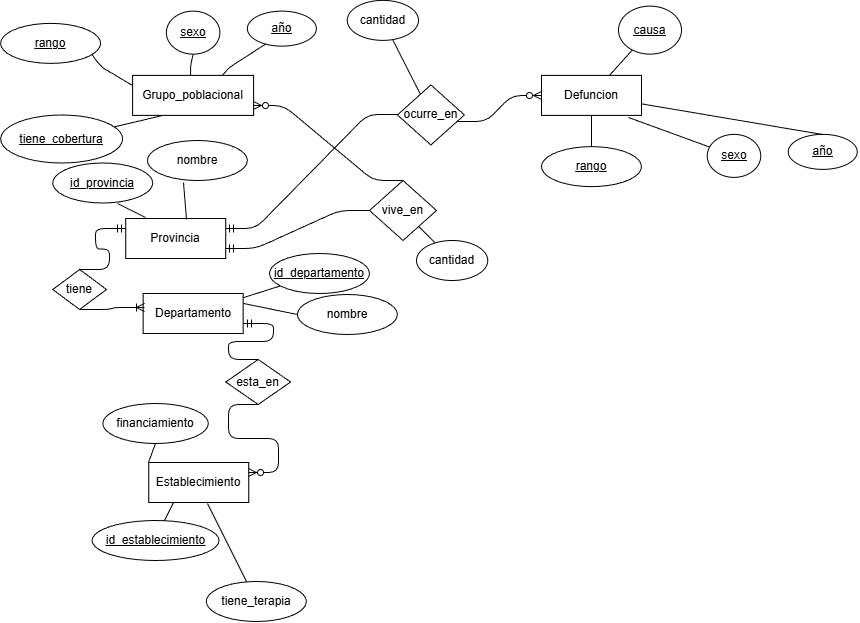
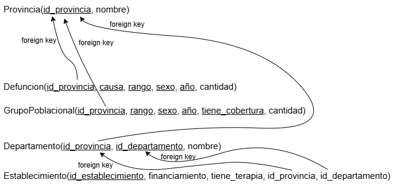
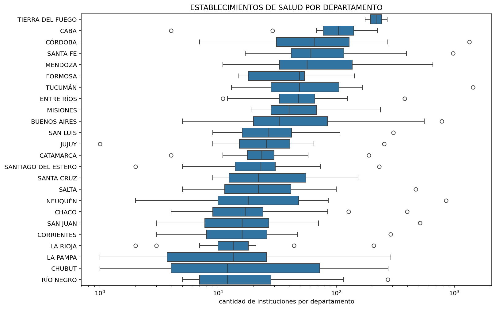
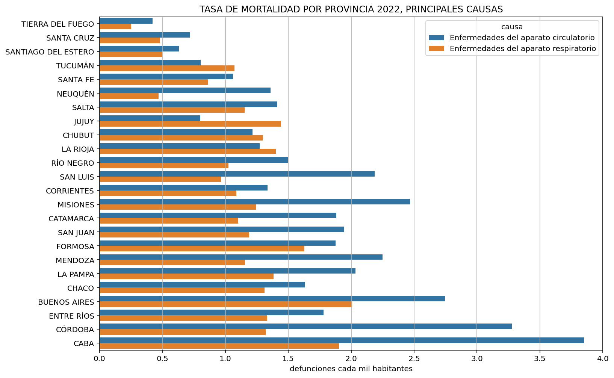
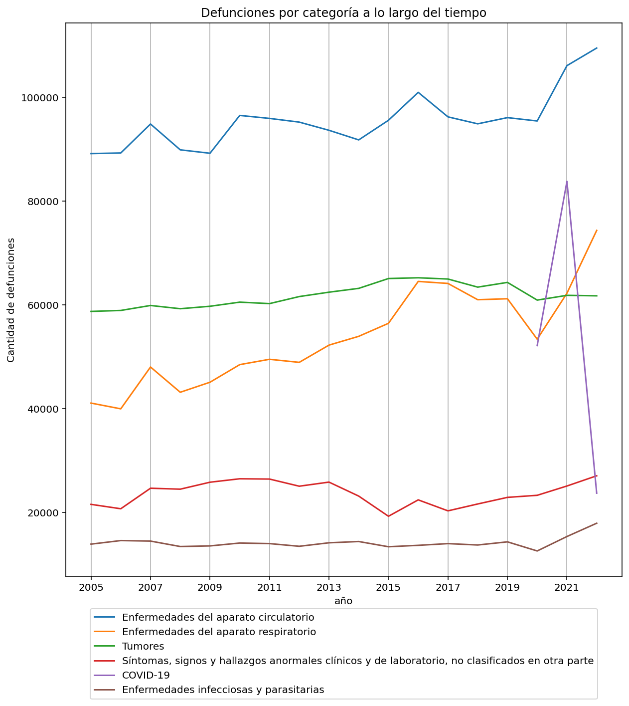

# Health Data Analysis in Argentina (2005-2022)

This project performs a comprehensive analysis of the relationship between causes of death, demographic variables, and healthcare access in Argentina. The objective was to transform raw, highly inconsistent data into a robust relational database, enabling complex queries and meaningful visualizations.

## 🚀 Technologies Used
* **Language:** Python
* **Processing:** `pandas`, `numpy`, `duckdb`
* **Database:** SQL (Relational Modeling)
* **Visualization:** `matplotlib`, `seaborn`

## 📊 Key Insights
* **Mortality Trends:** Identified a progressive increase in circulatory system diseases, surpassing other historical categories.
* **COVID-19 Impact:** Analyzed the significant impact on general statistics during 2020 and 2021.
* **Demographic Correlations:** Established a relationship between birth rates and deaths from perinatal conditions, along with a comparative analysis of mortality rates by province.

## 🛠 Methodology (Data Cleaning & Engineering)
The process addressed critical data quality challenges, including:
1. **Cleaning:** Handled nested tables, inconsistent headers, and normalized department names.
2. **Modeling:** Designed an Entity-Relationship Diagram (ERD) and normalized data up to 3NF (Third Normal Form) to ensure integrity.
3. **Quality:** Applied the **GQM** (Goal-Question-Metric) technique to quantify data completeness and consistency, removing erroneous records representing less than 1% of the total.

## 📈 Key Visualizations








## ⚙️ How to Run
1. Clone the repository:
   ```bash
   git clone https://github.com/elciclon/argentina-health-statistics-etl.git
